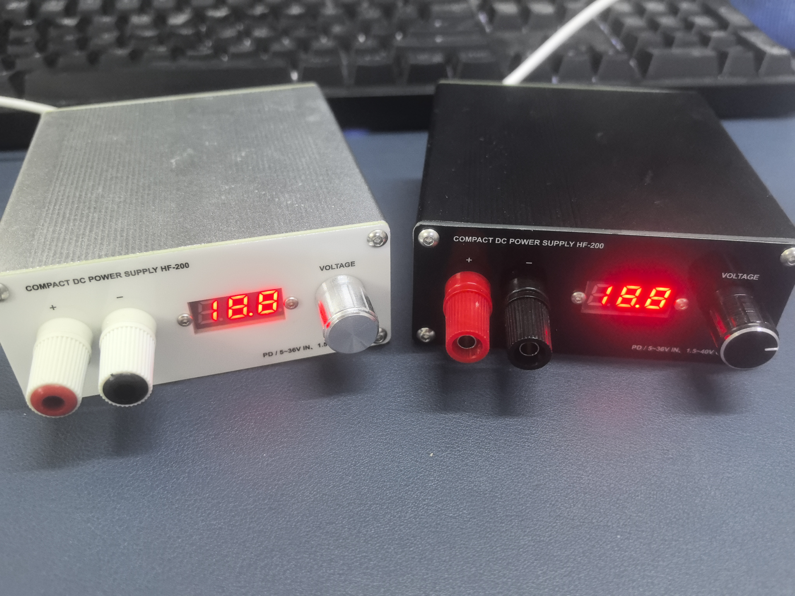

# SC8701-4-Switch-Buck-Boost-Power-Supply

> **SC8701四开关Buck-Boost电源**

> **主电路**

本项目是[基于XL6019的双输入模式SEPIC迷你电源](https://github.com/G-SS-Hacker/Dual-Input-Mini-DC-Power-Supply)升级版

开源硬件项目：基于SC8701的四开关Buck-Boost电源，负载电流达10A，可以用于桌面电路调试。

基本参数
+ 输入：PD或5-36V直流稳压输入
+ 输出：2-40V直流稳压输出，最大负载电流10A
+ 体积：40×97×100mm
+ 耐压：±50V
+ 设计特点：模块化紧凑设计、双输入模式，自适应升降压，前面板电压数显+香蕉头输出
+ PMIC： SC8701（华为车载充电器方案）
+ MOS管：PSMN8R5-60YS

